University of Dayton

Department of Computer Science

CPS 490 - Capstone I, Fall 2020

Instructor: Dr. Phu Phung


# Capstone I Project 


## Courier: The Messenger Application


## Team 8

1.  Jacob Scheetz, scheetzj2@udayton.edu 101537208
2.  Beth Hosek, hoseke1@udayton.edu
3.  Justen Stall, stallj2@udayton.edu 101447307
4.  Dena Schaeffer, backd1@udayton.edu 101483690


## Project Management Information

Management board (private access): <https://trello.com/b/ddzbQQx4/team-project>

Source code repository (private access): <https://bitbucket.org/cps490f20-team8/cps490-project-team8/src/master/>


### Revision History

| Date     |   Version     |  Description |
|----------|:-------------:|-------------:|
|11/30/2020|  0.4          | Sprint 3
|10/28/2020|  0.3          | Sprint 2     |
|09/30/2020|  0.2          | Sprint 1     |
|09/10/2020|  0.1          | Added details|
|09/03/2020|  0.0          | Init draft   |


## Overview

The messenger application is a live-chat application that communicates between the client and chat server (web application in Node.js). 

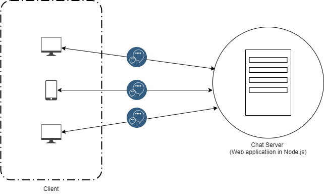

## System Analysis

* In the current state of the application, sprint 3, we are able to deploy our application to Heroku so that the hosting is taken care of. 
* With this, the application does not have to be spun up locally to interact with the application everytime. This allows users to access the app who are not on the local machine.

### User Requirements

- Users can type text and send to active users list
- Users can type text and send to a single receiver
- Users can type text and send to a group
- Users can create a group
- Users can register to the system
- Users can login with a registered account
- Users should receive the messages sent to them in real time
- Users can view the message history
- Store chat messages in database
- Encrypt passwords
- Users can view the message history
- Secure against web attacks
- Users can send clickable URLs
- Filter language
- Users can logout
- Users can toggle between light mode and dark mode


## Use cases

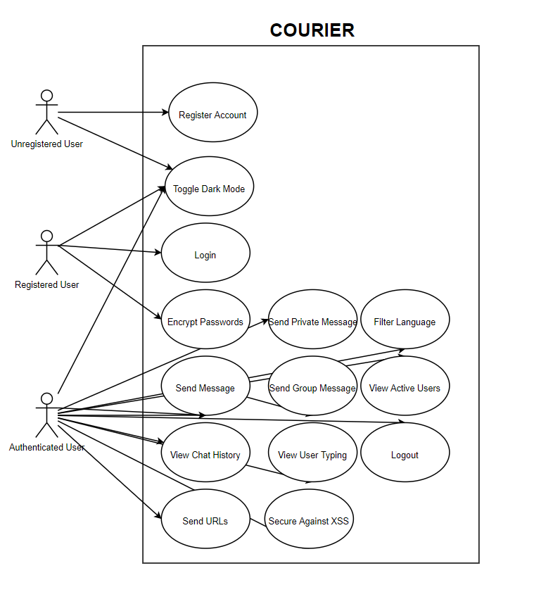

#### Register an Account
 * Actor: Unregistered user
 * User Story: As an unregistered user, I want to register to gain access to the application features
 * Use Case Description: in index.html, user will enter a username and password. Then in the ChatServer.js, the username and password are checked against security requirements. If it passes, messengerdb.js will check it against existing users, and add it to the database with a hashed password if the username is not taken. If taken, user is brought back to registration screen. If avaialable, user is taken to login screen.
#### Login
 * Actor: Registered User
 * User Story: As a registered user, I want to login to access the features for registered users.
 * Use Case Description: in index.html, user enters username and password. Then in ChatServer.js, a boolean variable is created, with the results of sending the username/password to messengerdb.js and checking it (while hashing the password) with the database. Back in ChatServer.js, if it returns true, the user will be pushed to the active list of users and the chat screen will be visible. If it returns false, the user will be notified and will stay on the login screen.
#### Send Message
 * Actor: Authenticated User
 * User Story: As a registered user, I want to send a message to all of the users in the users list.
 * Use Case Description: In index.html, user identifies 'all users' as a recipient and typed message is read. Then in ChatServer.js, check that user is authenticated.  After that, check message for language, and send the message object with inputted&filtered message, sender, reciever (all), and timestamp. Message object is stored via messengerdb.js, and sent from ChatServer.js to index.html, where it is displayed
#### Send Private Message
 * Actor: Authenticated User
 * User Story: As a registered user, I want to be able to send a private message to another user.
 * Use Case Description: In index.html, user identifies a specific user as a recipient and typed message is read. Then in ChatServer.js, check that user is authenticated.  After that, check message for language, and send the message object with inputted&filtered message, sender, reciever, and timestamp. Message object is stored for both sender and reciever via messengerdb.js, and sent from ChatServer.js to index.html, where it is displayed
#### Create Group
 * Actor: Authenticated User
 * User Story: As a registered user, I want to be able to create a group from logged-in users
 * Use Case Description: in index.html, select users for group from logged-in users and input group name. Then in ChatServer, create group. Back in index.html, group should be a selectable reciepient.
 #### Send Group Chat
 * Actor: Authenticated User
 * User Story: As a registered user, I want to be able to create and send messages to a group of selected users from the active user list. 
 * Use Case Description: In index.html, user identifies a group as a recipient and typed message is read. Then in ChatServer.js, check that user is authenticated.  After that, check message for language, and send message object with inputted&filtered message, sender, reciever (group), and timestamp. Message object is stored via messengerdb.js, and sent from ChatServer.js to index.html, where it is displayed
#### View Message History
 * Actor: Authenticated User
 * User Story: As a registered user, I want to be able to view the message history from times I am logged out or inactive.
 * Use Case Description: on login, in index.html call to colllect all mesages for any given user (public, private, and group messages). messengerdb.js will collect messages from the database and send back through ChatServer.js. Then, index.html will display them in the appropriate windows.
#### User Typing Notification
 * Actor: Authenticated User
 * User Story: As a registered user, I want to see when other users are typing a message. 
 * Use Case Description: on action of typing, in index.html call the typing function, which in ChatServer.js will create a message of "(user) is typing" and call index.html, which will broadcst it to all users. when sending memssage, broadcast will end.
#### Dark Mode
 * Actor: Unregistered, Registered, and Authenticated User
 * User Story: As a user, I want to be able to toggle dark mode with the click of a button.
 * Use Case Description: In index.html, click of butten detects the background color (White or Black), and changes to the opposite. This will also change the color of the text & the chat bubbles.
#### Send URLs
 * Actor: Authenticated User
 * User Story: As a registered user, I want to be able to send clickable URLS through the messages.
 * Use Case Description: In index.html, check user-inputted message to be a URL using regulat expression. If message is found to be a URL, display clickable link
#### Secure Against XSS
 * Actor: Authenticated User
 * User Story: As a registered user, I want to be protected against cross site scripting. 
 * Use Case Description: in ChatServer.js, xss filter, the result of adding a username, messages sent to any/all users and all properties of a message (sender/reciever/timestamp) to prevent against malicious insertion of code
#### Filter Language
 * Actor: Authenticated User
 * User Story: As a registered user, I want to have foul language filtered out in the messages and be alerted if my message is filtered.
 * Use Case Description: in ChatServer.js, before sending a message filter for swear words from a given list. If a swearword is found, replace word with asteriks same length of word, and call index.html to alert user that message  has been filtered. Then, proceede with sending message function
#### Encrypt Passwords
 * Actor: Authenticated User
 * User Story: As a registered user, I want to have my password encrypted for my account to increase security. 
 * Use Case Description: When creating user, once it gets to messenger.db to add user to database, hash the password and store the hashed password instead. Then, when logging in, same file will hash the plaintext password entered by the user and check that to the hashed password in the database.
#### Active Users List
 * Actor: Authenticated User
 * User Story: As a registered user, I want to have an updated list of active users who are logged into the chat application.
 * Use Case Description: On login, index.html will display a list of all users who have previously logged in, using the users list in ChatServer.js. On logout, the users list is called again in ChatServer.js, and will update for active users via index.html
#### Logout
 * Actor: Authenticated User
 * User Story: As a registered user, I want to be able to logout of the application.
 * Use Case Description: On logout via the button, user will be redirected back to the loginUI via index.html. Then for all logouts (either via the logout button or by exiting the tab), chatserver.js will remove user from list of active users and emit message to still-active users that the user has left the chat. Then active user list will be updated to remove user so you cannot send them any messages.


## System Design
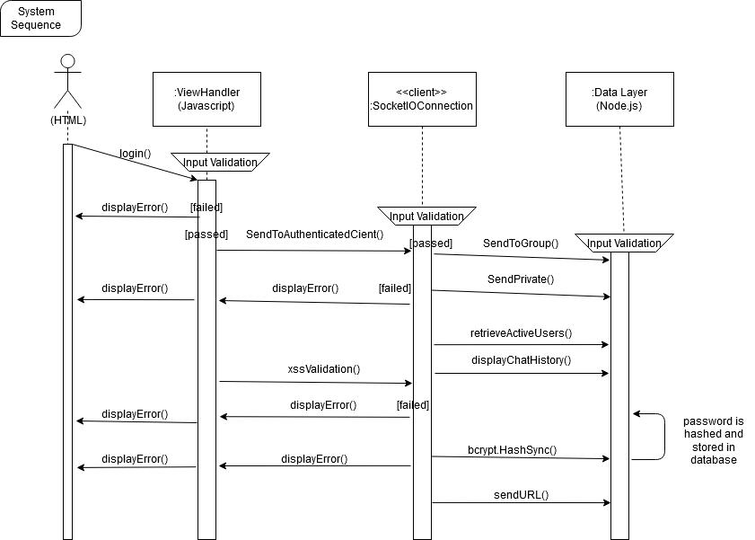

* Our system is designed such that a user must login before they are able to access the application.
* Once logged in, the user is able to send messages to everyone, send messages privately, or view the messages they have been sent.

### Database
* MongoDB hosted the data for our messaging application. It stores the registered user data, consisting of their username and hased passwords. This database also stores the messages sent in general and private messages. This data is stores in JSON files that are later parsed through upon login or retrieval of chat history. 

### User Interface

* Our first distinctive UI element that we have implemented into our system is a Dark Mode toggle button. 
* This implementation allows the end user to click a button to change the interface color depending on preference.
* Our third implementation is showing when a user is typing to a group. 
* Users can toggle between different chat rooms
* A simple and familiar chat design was implemented with chat bubbles. The chat bubbles are separated by having the sending user's messages to the right side of the site, and other user's messages recieved on the left side. 
* There are notifications that alert of a user logging in and out that are centered on the screen. 

## Implementation
We implemented the following use cases into our messenger application:

* Users need to login with username/password. Invalid username/password cannot be logged in
```JavaScript
  
  		socketclient.on("login", async (username, password) => {
        	console.log("Debug>got username=" + username + " password=" + password);
        	var checklogin = await DataLayer.checklogin(username, password);
        	socketclient.username = username;
        	if (checklogin) {
            	users.push({
                	id: socketclient.id,
                	username: username
            	});
            	socketclient.authenticated = true;
            	socketclient.emit("authenticated", username);
            	socketclient.username = username;
            	var welcomemessage = username + " has joined the chat system!";
            	console.log(welcomemessage);
            	// socketio.sockets.emit("welcome", welcomemessage);
            	socketio.emit("newuser", users);
            	SendToAuthenticatedClient(socketclient, "welcome", welcomemessage);
            	console.log(users);
```
```HTML
	function login() {
         var username = document.getElementById('username').value;
         var password = document.getElementById('password').value;

         socketio.on("welcome", (welcomemessage) => {
             var timestamp = Date.now();
             messages.push({
                 message: welcomemessage,
                 receiver: 'all',
                 sender: 'none',
                 timestamp: timestamp
             });
             displayMessages();
            });
         socketio.emit("login", username, password);
        }
```
* Anyone can register for a new account to log in
```JavaScript
    socketclient.on("register", (username, password) => {
        if (validateUsername(username) && validatePassword(password)) {
            DataLayer.addUser(username, password, (result) => {
                var data = xssfilter(result);
                socketclient.emit("registration", data);
            });
        } else {
            var result = "invalid login"
            var data = xssfilter(result);
            socketclient.emit("registration", data);
        }
    });
	
	function validateUsername(username) {
   		 return (username && username.length > 4);
	}

	function validatePassword(password) {
   		 //require at least one digit, one upper and lower case letter
  		 return /(?=.*\d)(?=.*[a-z])(?=.*[A-Z]).{6,}/.test(password);
	}
```
```html
 	function register() {
            var username = document.getElementById('newusername').value;
            var password = document.getElementById('newpassword').value;

            socketio.on("welcome", (welcomemessage) => {
                document.getElementById('messages').innerHTML += sanitizeHTML(welcomemessage) + "<br>";
            });

            socketio.emit("register", username, password);
        }
```
* Only logged-in users can send/receive messages (any)
```javascript

    socketclient.on("chat", (message) => {
        if (!socketclient.authenticated) {
            console.log("Unauthenticated client sent a chat. Supress!");
            return;
        }
        var newMessage = filterMessage(message);
        var chatmessage = message;
        var timestamp = Date.now();
        var chatmessage = {
            message: newMessage,
            sender: socketclient.username,
            receiver: 'all',
            timestamp: timestamp
        }
        console.log(chatmessage);
        // socketio.sockets.emit("chat", chatmessage);
        SendToAuthenticatedClient(socketclient, "chat", chatmessage);
    });
```
```html
        function sendmessage() {
 
            if (recipient === 'all') {
                socketio.emit("chat", document.getElementById('yourmessage').value);
            } else if (groupRecipient) {
                console.log('sending group chat');
                socketio.emit("groupchat", {
                    message: document.getElementById('yourmessage').value,
                    groupName: recipient
                });
            } else {
                console.log(recipient)
                var receivingUser = users.find(user => user.username === recipient);
                console.log(receivingUser)
                console.log('sending private chat');
                socketio.emit("privatechat", {
                    message: document.getElementById('yourmessage').value,
                    socketId: receivingUser.id,
                    receiver: recipient
                });
                // console.log('private chat emitted');
            }
        }
```
* Logged-in users can logout
```javascript
    socketclient.on("logout", () => {
        users = users.filter(user => user.id !== socketclient.id);

        var logoutmessage = {
            message: socketclient.username + " has disconnected from the chat",
            sender: 'all'
        }
        // emit a chat to send logout message
        socketio.sockets.emit("chat", logoutmessage);

        // emit newuser to update active user list
        socketio.sockets.emit("newuser", users);

        var logmsg = "Debug:> logged out";
        console.log(logmsg);

        socketclient.disconnect();
        // socketclient.id = null;
    });
```
```html
        function logout() {
            socketio.emit("logout");
            hideChatScreen();
            showLoginScreen();
        }
```
* Logged-in users can create a group chat (more than 2 members)
```javascript
    socketclient.on("creategroup", (groupName, selections) => {
        console.log("users being added to group:", selections);
        selections.forEach(element => {
            socketio.sockets.connected[element].join(groupName);
        });
        groups.push(groupName);
        socketio.to(groupName).emit("newgroup", groupName);
        console.log(groups);
    });
```
```html
        function createGroup() {
            var userSelect = document.getElementById('userSelect');
            var groupName = document.getElementById('groupName').value;
            var selections = [];
            selections = Array.from(userSelect.selectedOptions).map(o => o.value)
            console.log(selections);
            socketio.emit("creategroup", groupName, selections);
        }
```
* Logged-in users in a group chat can send/receive messages from the group
```javascript
        function sendmessage() {
 
            if (recipient === 'all') {
                socketio.emit("chat", document.getElementById('yourmessage').value);
            } else if (groupRecipient) {
                console.log('sending group chat');
                socketio.emit("groupchat", {
                    message: document.getElementById('yourmessage').value,
                    groupName: recipient
                });
            } else {
                console.log(recipient)
                var receivingUser = users.find(user => user.username === recipient);
                console.log(receivingUser)
                console.log('sending private chat');
                socketio.emit("privatechat", {
                    message: document.getElementById('yourmessage').value,
                    socketId: receivingUser.id,
                    receiver: recipient
                });
                // console.log('private chat emitted');
            }
        }
```
```html
    socketclient.on("groupchat", (message) => {
        if (!socketclient.authenticated) {
            console.log("Unauthenticated client sent a chat. Supress!");
            return;
        }
        // var stringmessage = "(" + message.groupName + ") " + socketclient.username + " says: " + message.message;
        var newMessage = filterMessage(message);
        var chatmessage = {
            message: "(" + message.groupName + ") " + socketclient.username + " says: " + newMessage,
            sender: message.groupName
        }
        console.log(chatmessage);
        socketio.to(message.groupName).emit("chat", chatmessage);
    })
```
* Seperated chat window for group chat
```html
        function createGroup() {
            var userSelect = document.getElementById('userSelect');
            var groupName = document.getElementById('groupName').value;
            var selections = []; //making a new array allows for a group message in a new window -- found in the user list
            selections = Array.from(userSelect.selectedOptions).map(o => o.value)
            console.log(selections);
            socketio.emit("creategroup", groupName, selections);
        }
```
* User typing notification
```javascript
    socketclient.on("typing", () => {
        var typingmessage = socketclient.username + " is typing...";
        socketclient.broadcast.emit("typing", typingmessage);
    });
```
```html
        function typing() {
            console.log("typing");
            socketio.emit("typing")
        }
```
* Dark Mode
```html
        function toggleDarkMode() {
            var body = document.body;
            var button = document.getElementById('dark-mode');
            var navbar = document.getElementById('navbar');
            var userList = document.getElementById("userList");
            var messages = document.querySelectorAll(".message-text");

            if (body.style.backgroundColor === "black") {
                body.style.backgroundColor = "white";
                body.style.color = "black";
                navbar.classList.remove('bg-dark');
                navbar.classList.remove('navbar-dark');
                navbar.classList.add('bg-light');
                navbar.classList.add('navbar-light');
                userList.style.color = 'rgb(33, 37, 41)';
                messages.forEach(message => {
                    message.classList.add('bg-light');
                    message.classList.remove('bg-dark');
                });
                button.innerHTML = "Dark Mode";
            } else {
                body.style.backgroundColor = "black";
                body.style.color = "white";
                navbar.classList.remove('bg-light');
                navbar.classList.remove('navbar-light');
                navbar.classList.add('bg-dark');
                navbar.classList.add('navbar-dark');
                userList.style.color = 'rgb(33, 37, 41)';
                messages.forEach(message => {
                    message.classList.remove('bg-light');
                    message.classList.add('bg-dark');
                });
                button.innerHTML = "Light Mode"
            }
        }
```
* Send Clickable URLs
```html
        function urlify(text) {
            var urlRegex = /(https?:\/\/[^\s]+)/g;
            return text.replace(urlRegex, function(url) {
            return '<a class="message-link" target="_blank" href="' + url + '">' + url + '</a>';
            })
                // or alternatively
                // return text.replace(urlRegex, '<a href="$1">$1</a>')
        }
```
* Prevent XSS Attacks
```javascript
	function SendToAuthenticatedClient(sendersocket, type, data) {
    	var sockets = socketio.sockets.sockets;
    	for (var socketId in sockets) {
        	var socketclient = sockets[socketId];
       		 if (socketclient.authenticated) {
          		  if (typeof data === 'object' && data !== null) {
            		    for (let property in data) {
              		      console.log('property:', data[property]);
              		      data[property] = xssfilter(data[property]);
              		      console.log('xss filtered:', data[property]);
              		  }
              		  data['timestamp'] = parseFloat(data['timestamp']);
              		  console.log('new object:', data);
         		   } else if (typeof data === 'string') {
         		       data = xssfilter(data);
         		   }
        	    socketclient.emit(type, data);
            	var logmsg = "Debug:>sent to " + socketclient.username + " with ID=" + socketId;
            	console.log(logmsg);
            	if(type=="chat")
                	messengerdb.storePublicChat(data);
        	}
    	}
	}
```
* Filter language 
```javascript
    function filterMessage(chatmessage) {
        //filter out all swearwords
        newMessage = chatmessage;

        var swear3 = /ass|pee/gi;
        var swear4 = /fuck|shit|damn|crap|piss|poop|hell|cunt/gi;
        var swear5 = /bitch/gi;
        var swear6 = /Justin/gi;
        var allSwears = ["ass", "fuck", "shit", "bitch", "damn", "crap", "piss", "poop", "pee", "hell", "Justin", "cunt"];

        for(x = 0; x <allSwears.length; x++)
        {
            if(newMessage.includes(allSwears[x]))
            {
                newMessage = newMessage.replace(swear3, "***");
                newMessage = newMessage.replace(swear4, "****");
                newMessage = newMessage.replace(swear5, "*****");
                newMessage = newMessage.replace(swear6, "******");

                socketclient.emit("swear");

                return newMessage;
            }
            
        }
        return newMessage;

    }
});
```
```javascript
    socketio.on("swear", () => {
        alert("Your message was filtered for foul language");
    });

```

* Encrypt Passwords
```javascript
	const bcrypt = require("bcryptjs")
	const checklogin = async (username, password) => {
    	console.log("Debug>messengerdb.checklogin: " + username + "/" + password);
    	var users = getDb().collection("users");
    	var user = await users.findOne({ username: username});
    	if (user != null && user.username == username) {
        	//var hashedpassword = bcrypt.hashSync(password);
        	console.log("Debug>messengerdb.checklogin-> user found:\n" + JSON.stringify(user));
        	//console.log(hashedpassword);
        	return bcrypt.compareSync(password, user.password);
    	}
    	return false
	}
	const addUser = (username, password, callback) => {
    	console.log("Debug>messengerdb.addUser:" + username + "/" + password)
    	var users = getDb().collection("users");
    	users.findOne({ username: username }).then(user => {
       		 if (user && user.username === username) {
          		  console.log(`Debug>messengerdb.addUser: Username '${username}' exists!`);
           		 callback("UserExist");
       		 } else {
           		 // input validation (password strength)
           		 // callback("InvalidInput");
           		 var hashedpassword = bcrypt.hashSync(password,10);
           		 var newUser = { "username": username, "password": hashedpassword }
          		  users.insertOne(newUser, (err, result) => {
          		      if (err) {
           		         console.log("Debug>messengerdb.addUser: error for adding '" + username + "':\n", err);
            		     callback("Error");
                	} else {
                    	console.log("Debug>messengerdb.addUser: a new user added: \n", result.ops[0].username);
                    	callback("Success");
                	}
            	});
        	}
    	});
	}
```
* Active Users List
```javascript
	var users = [];
	 	if (checklogin) {
            users.push({
                id: socketclient.id,
                username: username
            });
	users = users.filter(user => user.id !== socketclient.id);

```
* Load Chat History

```javascript
	const storePublicChat = (message) => {
    	//TODO: validate the data and print out debug info
    	getDb().collection("public_chat").insertOne(message, function(err,doc){
        	if (err != null) {
            	console.log(err);
        	} else {
            	console.log("Debug: message is added:" + JSON.stringify(doc.ops));
        	}
   		});
	}
	const loadChatHistory = async (receiver, limits=100) => {
    	//TODO: fix the find so that it can get by receiver and by all
    	var private_chat_history = await getDb().collection("public_chat").find({receiver:receiver}).sort({timestamp:-1}).limit(limits).toArray();
    	var public_chat_history = await getDb().collection("public_chat").find({receiver:"all"}).sort({timestamp:-1}).limit(limits).toArray();
    	var appended_history = private_chat_history.concat(public_chat_history);
    	//print debug info ex. using JSON.stringify(chat_history)
    	if (appended_history && appended_history.length > 0) 
        	return appended_history;
    	//print debug info ex. using JSON.stringify(chat_history)
	}
	module.exports = { checklogin, addUser,storePublicChat, loadChatHistory }
```

### Deployment

* Our team decided to deploy the application onto Heroku so that we would be able to maintain version control, have a central point to collaborate on the code, and have the ability to create a dynamic web application.
* URL: <https://cps490-messenger.herokuapp.com/>
* Latest Commit: <https://bitbucket.org/cps490f20-team8/cps490-project-team8/commits/71434f1c18c05d3290148026511c5c6a3d378bfe> UPDATE LATER

## Evaluation

* Users can toggle between light mode: 

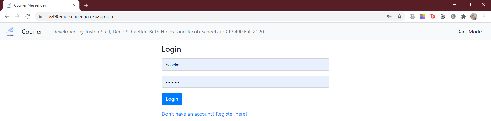
* Or dark mode:

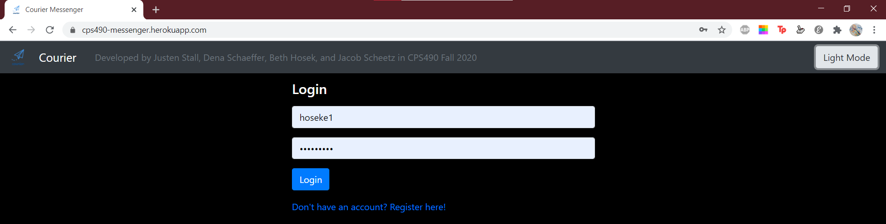

* Users can register to the system:

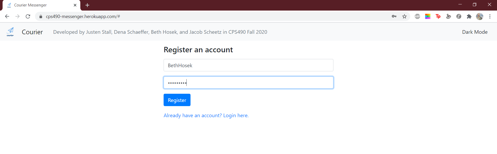

* And users will be  directed to logon once registered:

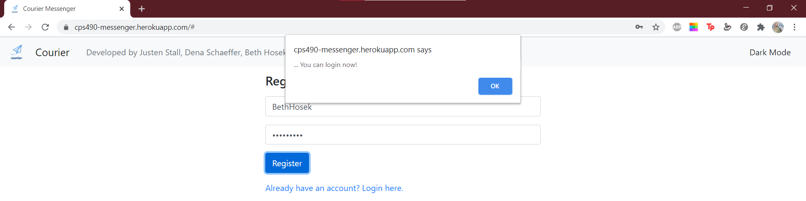

* Users can logon to the system with their username and password:

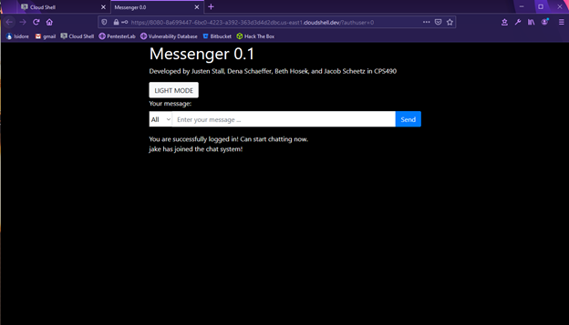

* Once logged in, the users can send messages in the chat and see who joins the chat:

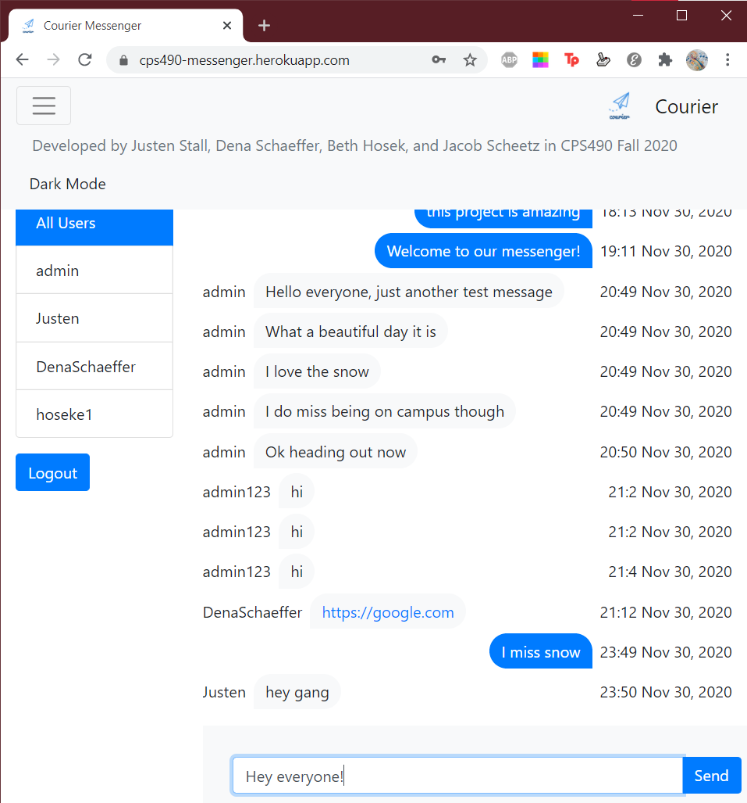
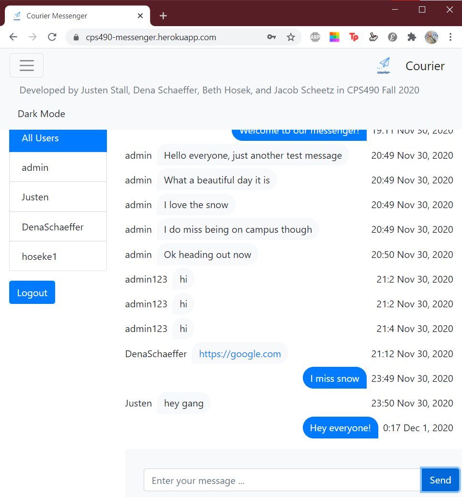

* Users can see when someone is typing:

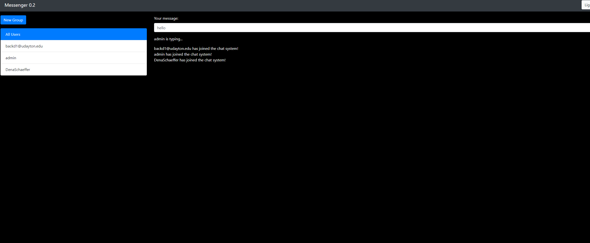

* Users can send a private chat via the selection of an active user:

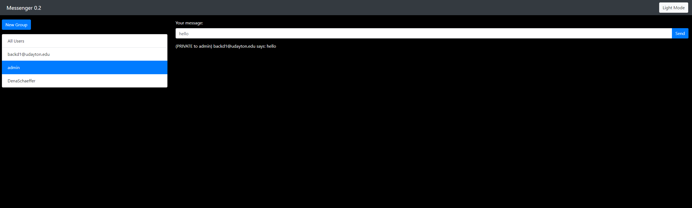

* Users can receive a private chat: 


* Users can create a group chat:

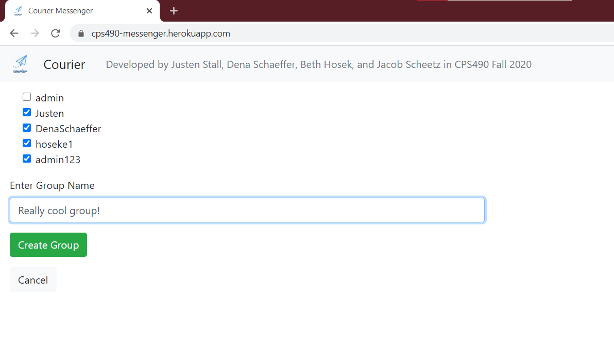
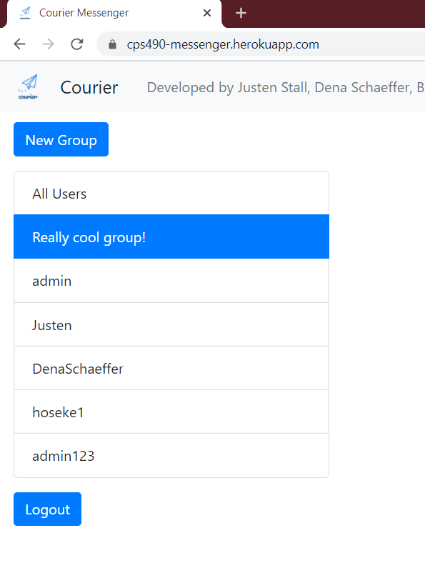

* Users can logout (brings user back to login screen and notifies active users): 


* Users can view the list of active users


* Store chat messages in database

* Passwords of users are encrpyted in the database
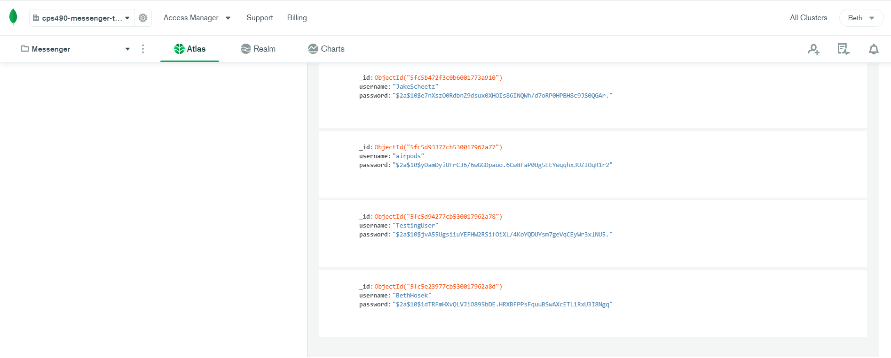

* Users can view the message history
* Secure against web attacks
* Users can send clickable URLs

* When users type foul language, they will be alerted and the message will be filtered

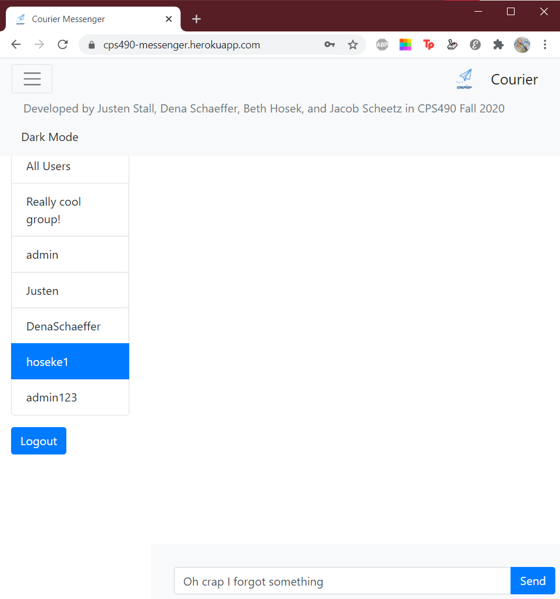

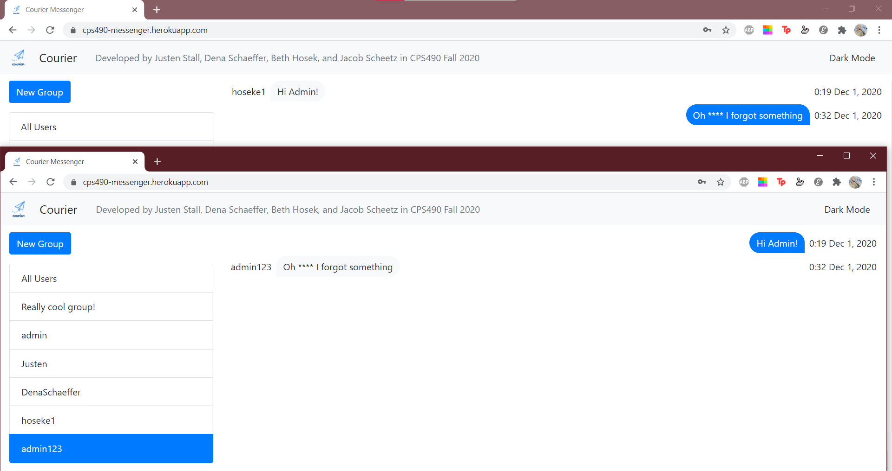

### Progress Report

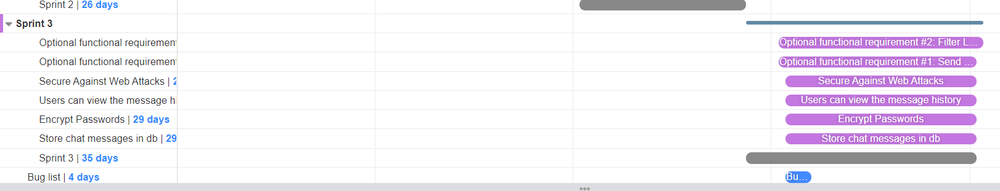
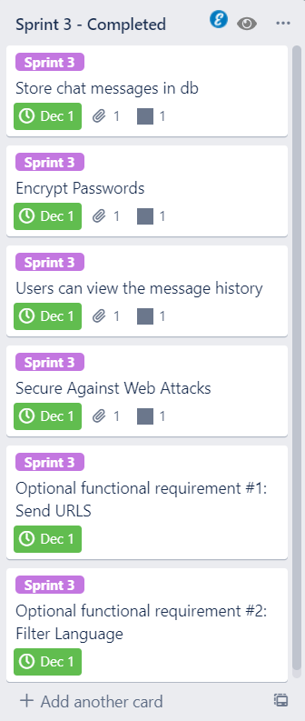

#### Sprint 0
##### Completed Tasks:
1. Use cases defined
2. Use case diagram made
3. Gantt chart created in Trello

##### Contributions: 

1.  Jacob Scheetz, 4 hours, contributed in use case, powerpoint, Trello, and use case diagram creation 
2.  Beth Hosek 2, 4 hours, contributed in use case, powerpoint, Trello, and use case diagram creation 
3.  Justen Stall, 4 hours, contributed in use case, powerpoint, Trello, and use case diagram creation 
4.  Dena Schaeffer, 4 hours, contributed in use case, powerpoint, Trello, and use case diagram creation 

Duration: 09-01-2020 to 09-10-2020

#### Sprint 1
##### Completed Tasks:
1. Ability to send message to everyone 
2. Login functionality 
3. Send messages to indiviuals
4. Read messages that have been sent to you

Duration: 09-11-2020 to 10-01-2020

##### Contributions: 

1.  Jacob Scheetz, 4 hours, contributed in README, class code updates, powerpoint slides 
2.  Beth Hosek 2, 4 hours, contributed in README, class code updates, powerpoint slides 
3.  Justen Stall, 4 hours, contributed in README, class code updates, powerpoint slides 
4.  Dena Schaeffer, 4 hours, contributed in README, class code updates, powerpoint slides 
##### Sprint Retrospective:

* We felt that working on the information on a regular basis as it was being discussed in class helped improve our understnafding of what we were developing
* We also felt that dividing tasks between the team members prior to working on things was most efficient in accomplishing tasks and heightening responsibility
* Lastly we felt that having regular meetings together gave us the opportunity to help each other out in areas that we may have been struggling or needed assistance

| Good     |   Could have been better    |  How to improve?  |
|----------|:---------------------------:|------------------:|
|   Great teamwork   |  We could have gone to office hours more   |     We can add more use cases to improve UX  |

#### Sprint 2
##### Completed Tasks:
1. User typing notifications
2. View list of active users
3. Logout functionality
4. Database implementation
5. User registration
6. Group chat implementation

Duration: 10-02-2020 to 10-29-2020

##### Contributions: 

1.  Jacob Scheetz, 8 hours, contributed in README, login and register, powerpoint slides 
2.  Beth Hosek 2, 8 hours, contributed in README, logout and use case diagrams, powerpoint slides 
3.  Justen Stall, 8 hours, contributed in README, authentication and separated chat windows, powerpoint slides 
4.  Dena Schaeffer, 8 hours, contributed in README, group messaging and use case diagrams, powerpoint slides 
##### Sprint Retrospective:
* There were no major issues with the code
* The regular meetings helped us with time management
* Dividing the tasks among members helped improve efficiency

| Good     |   Could have been better    |  How to improve?  |
|----------|:---------------------------:|------------------:|
|   No issues with the code      |    Deployment to Heroku resulted in bugs      |   Work on bug fixes throughout           |

#### Sprint 3
##### Completed Tasks:
1. Store chat messages in database
2. Encrypt passwords
3. Users can view the message history
4. Secure against web attacks
5. Users can send clickable URLs
6. Filter language

Duration: 10-30-2020 to 11-30-2020

##### Contributions: 

1.  Jacob Scheetz, 24 hours, contributed in use case, powerpoint, Trello, and use case diagram creation and implementation
2.  Beth Hosek 2, 24 hours, contributed in use case, powerpoint, Trello, and use case diagram creation and implementation
3.  Justen Stall, 24 hours, contributed in use case, powerpoint, Trello, and use case diagram creation and implementation
4.  Dena Schaeffer, 24 hours, contributed in use case, powerpoint, Trello, and use case diagram creation and implementation

##### Sprint Retrospective:
* We focused on improving the design
* We met more frequently to work on the application

| Good     |   Could have been better    |  How to improve?  |
|----------|:---------------------------:|------------------:|
|   More frequent meetings to implement use cases      |    Deploying to Heroku      |   We could have worked on the bugs as we discovered them, rather than adding it to a bug list           |
