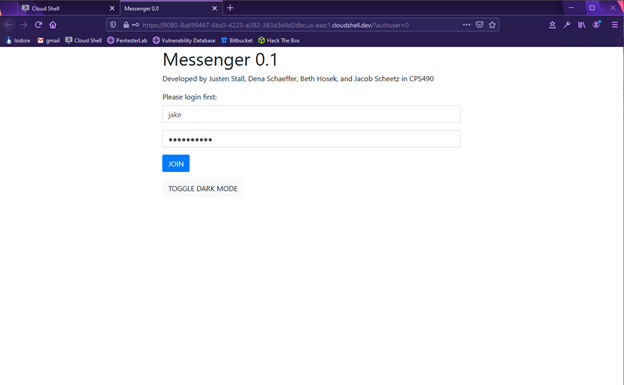
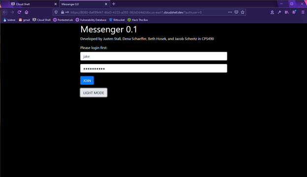
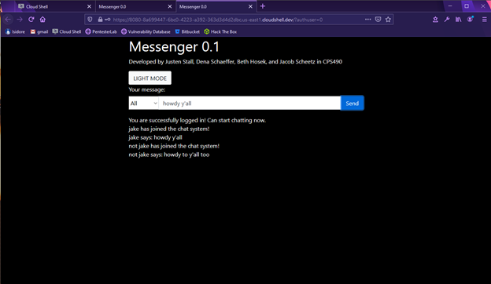
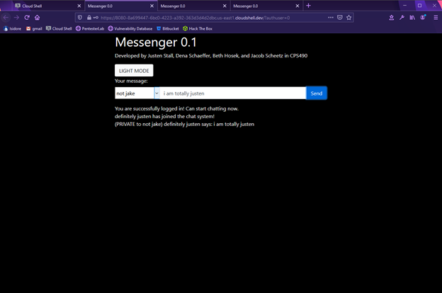
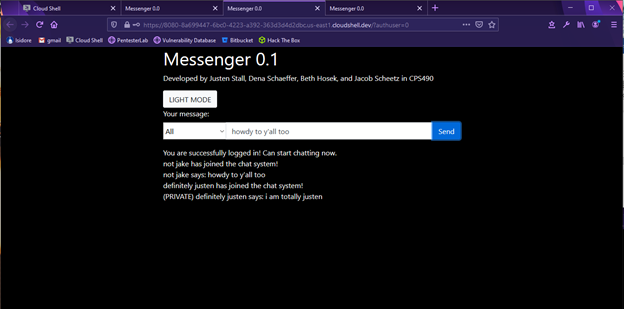
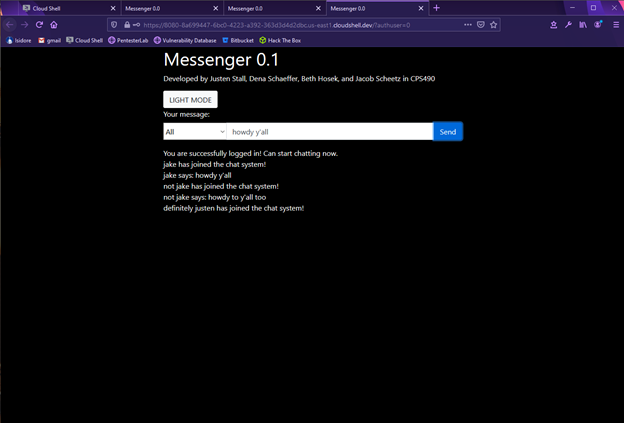

# README.md - CPS490 Report Template

Source: <https://bitbucket.org/capstones-cs-udayton/cps490/src/master/README.md>

*NOTE*: _This is just a tentative template for your team to start working on sprint 0. It is a minimum requirement for your project final report and can be updated later.
Your team can revise/add more sections, however, it is highly recommended to seek approval from the instructor for a pull request._

University of Dayton

Department of Computer Science

CPS 490 - Capstone I, Semester Year

Instructor: Dr. Phu Phung


## Capstone I Project 


# The Messenger Application


# Team members

1.  Jacob Scheetz, scheetzj2@udayton.edu
2.  Beth Hosek, hoseke1@udayton.edu
3.  Justen Stall, stallj2@udayton.edu
4.  Dena Schaeffer, backd1@udayton.edu


# Project Management Information

Management board (private access): <https://trello.com/b/ddzbQQx4/team-project>

Source code repository (private access): https://bitbucket.org/cps490f20-team8/cps490-project-team8/src/master/


## Revision History

| Date     |   Version     |  Description |
|----------|:-------------:|-------------:|
|10/28/2020|  0.3          | Sprint 2     |
|09/30/2020|  0.2          | Sprint 1     |
|09/10/2020|  0.1          | added details|
|09/03/2020|  0.0          | Init draft   |


# Overview

The messenger application is a live-chat application that communicates between the client and chat server (web application in Node.js). 


# System Analysis

* In the current state of the application, sprint 2, we are able to deploy our application to Heroku so that the hosting is taken care of. 
* With this, the application does not have to be spun up locally to interact with the application everytime. This allows users to access the app who are not on the local machine.

## User Requirements

- Users can type text and send a single receiver
- Users can type text and send to a group
- Users can register to the system
- Users can login with a registered account
- Users should receive the messages sent to them in real time
- Users can view the message history
- Users can see if the sent messages have been read


## Use cases


 * Unregisted users can only register to the system
 * Registered users can log in using their registered information
 * Registered users can send a message to an individual or guest receiver
 * Registered users can view message history
 * Registered users can see if messages have been read by the receiver

# System Design

* Our system is designed such that a user must login before they are able to access the application.
* Once logged in, the user is able to send messages to everyone, send messages privately, or view the messages they have been sent.

## Use-Case Realization

* The functionality that we as a team feel is necessary to implement next is the ability to show a list of active users within the system. We feel that this will help improve the practicality of our application

## Database 

* MongoDB is the database hosting the data for our app. It stores the registered user data into a JSON file that is later parsed through upon login.

## User Interface

* Our first distinctive UI element that we have implemented into our system is a Dark Mode toggle button. 
* This implementation allows the end user to click a button to change the interface color depending on preference.
* Our second implementation is having read receipts on messages a user has sent.
* Our third implementation is showing when a user is typing to a group. 

# Implementation
## Sprint 2
* During this sprint, we were working on the smaller details for our messenger application.
* We implemented further use cases to our app:
1. Users need to login with username/password. Invalid username/password cannot be logged in
2. Anyone can register for a new account to log in
3. Only logged-in users can send/receive messages (any)
4. Logged-in users can logout
5. Logged-in users can create a group chat (more than 2 members)
6. Logged-in users in a group chat can send/receive messages from the group
7. Seperated chat window for group chat
8. Read receipts
9. User typing notification
* Similar to sprint 1, the implementations were deployed on Heroku, furthering our development of the ChatServer.js file in node and updating the home page in HTML.
* The updates to ChatServer.js are in the code snippets below:

```
//ADD STUFF HERE!!!!!!
```
## Deployment

* Our team deployed our application onto Heroku so that we would be able to maintain version control, have a central point to collaborate on the code, and have the ability to create a dynamic web application.

## Sprint 1

* During this sprint, we were mainly focused on the funtionality of our messenger application. 
* We implemented the following the uses: The ability to login to the system, the ability to send messages to groups, the ability to send a message to a single user, and the ability to toggle dark and light mode on the interface. 
* This implementations were done by deploying the application on Heroku, furthering our development of the ChatServer.js file in node and updating the home page in HTML. 
* the updates to ChatServer.js are in the code snippets below:
``` 
function SendToAuthenticatedClient(sendersocket, type, data){
    var sockets = socketio.sockets.sockets;
    for(var socketId in sockets){
        var socketclient=sockets[socketId];
        if(socketclient.authenticated){
            socketclient.emit(type,data);
            var logmsg= "Debug:>sent to " + socketclient.username + " with ID=" + socketId;
            console.log(logmsg);
        }
    }

}
```

```
socketio.on("connection", function (socketclient) {
    console.log("A new Socket.IO client is connected. ID= " + socketclient.id)
    socketclient.on("login", (username,password) => {
        socketclient.username = username;
        console.log("Debug>got username=" + username + " password="+ password);
        if(DataLayer.checklogin(username,password)){
            socketclient.authenticated=true;
            socketclient.emit("authenticated");
            var welcomemessage = username + " has joined the chat system!";
            console.log(welcomemessage);
            //socketio.sockets.emit("welcome", welcomemessage);
            SendToAuthenticatedClient(socketclient, "Welcome", welcomemessage);
          }
    }

        
    socketclient.on("chat", (message) => {
        if(!socketclient.authenticated)
        {
            console.log("Unauthenticated client sent a chat. Supress!");
            return;
        }
        var chatmessage = socketclient.username + " says: " + message;
        console.log(chatmessage);
        socketio.sockets.emit("chat", chatmessage);
        }
    });
```

## Deployment

* Our team decided to deploy the application onto Heroku so that we would be able to maintain version control, have a central point to collaborate on the code and have the ability to create a dynamic web application.

# Software Process Management

_(Start from Sprint 0, keep updating)_

Introduce how your team uses a software management process, e.g., Scrum, how your teamwork, collaborate.

Include the Trello board with product backlog and sprint cycles in an overview figure and also in detail description. _(Main focus of Sprint 0)_

Also, include the Gantt chart reflects the timeline from the Trello board. _(Main focus of Sprint 0)_


## Scrum process

### Sprint 0
#### Completed Tasks:
1. Use cases defined
2. Use case diagram made
3. Gantt chart created in Trello

#### Contributions: 

1.  Jacob Scheetz, 4 hours, contributed in use case, powerpoint, Trello, and use case diagram creation 
2.  Beth Hosek 2, 4 hours, contributed in use case, powerpoint, Trello, and use case diagram creation 
3.  Justen Stall, 4 hours, contributed in use case, powerpoint, Trello, and use case diagram creation 
4.  Dena Schaeffer, 4 hours, contributed in use case, powerpoint, Trello, and use case diagram creation 


Duration: 09-01-2020 to 09-10-2020

### Sprint 1
#### Completed Tasks:
1. Ability to send message to everyone 
2. Login functionality 
3. Send messages to indiviuals
4. Read messages that have been sent to you

Duration: 09-11-2020 to 10-01-2020


#### Contributions: 

1.  Jacob Scheetz, 4 hours, contributed in README, class code updates, powerpoint slides 
2.  Beth Hosek 2, 4 hours, contributed in README, class code updates, powerpoint slides 
3.  Justen Stall, 4 hours, contributed in README, class code updates, powerpoint slides 
4.  Dena Schaeffer, 4 hours, contributed in README, class code updates, powerpoint slides 

### Sprint 2
#### Completed Tasks:
1. 

Duration: 


#### Contributions: 

1.  Jacob Scheetz, 8 hours, contributed in README, class code updates, powerpoint slides 
2.  Beth Hosek 2, 8 hours, contributed in README, class code updates, powerpoint slides 
3.  Justen Stall, 8 hours, contributed in README, class code updates, powerpoint slides 
4.  Dena Schaeffer, 8 hours, contributed in README, class code updates, powerpoint slides 

#### Sprint Retrospective:
### Sprint 2: ###
```
ADD STUFF HERE
```
| Good     |   Could have been better    |  How to improve?  |
|----------|:---------------------------:|------------------:|
|   x      |                             |                   |

### Sprint 1: ###
* We felt that working on the information on a regular basis as it was being discussed in class helped improve our understnafding of what we were developing
* We also felt that dividing tasks between the team members prior to working on things was most efficient in accomplishing tasks and heightening responsibility
* Lastly we felt that having regular meetings together gave us the opportunity to help each other out in areas that we may have been struggling or needed assistance

| Good     |   Could have been better    |  How to improve?  |
|----------|:---------------------------:|------------------:|
|   x      |                             |                   |


# User guide/Demo

Write as a demo with screenshots and as a guide for users to use your system.

* users can toggle between light mode: 

* or dark mode:


* users can logon to the system with their username and password:


* Once logged in, the users can send messages in the chat and see who joins the chat:


* users can send a private chat via the drop down menu interface of active users:


* users can receive a private chat: 


* users private messages are not seen by others that are not recipients in the same chat: 


